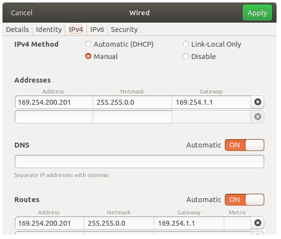

# Niryo

## Ethernet Connection

1. Turn robot on and wait for light to be blue
1. Connect ethernet cable
1. Configure the wired connection's IPv4 tab to resemble this



4. Verify the connection by pinging Niryo
    ```sh
    ping 169.254.200.201
    ```
1. Create an environment including the following packages and their dependencies
    - `ros-noetic-desktop`
    - `jupyterlab-ros`
    - `jupyterlab-blockly`
    - `jupyterlab-niryo-one`
1. Activate the environment and change the ROS master environment variable
    ```sh
    export ROS_MASTER_URI=http://169.254.200.200:11311
    ```
1. Check that the remote computer can see the list of ROS topics from the Niryo
    ```
    rostopic list

    # Should return many topics
    /attached_collision_object
    /client_count
    /collision_object
    /connected_clients
    /execute_trajectory/cancel
    /execute_trajectory/feedback
    /execute_trajectory/goal
    /execute_trajectory/result
    /execute_trajectory/status
    /joint_states
    /move_group/cancel
    /move_group/display_contacts
    /move_group/display_planned_path
    /move_group/feedback
    /move_group/goal
    /move_group/monitored_planning_scene
    /move_group/ompl/parameter_descriptions
    /move_group/ompl/parameter_updates
    /move_group/plan_execution/parameter_descriptions
    /move_group/plan_execution/parameter_updates
    /move_group/planning_scene_monitor/parameter_descriptions
    /move_group/planning_scene_monitor/parameter_updates
    /move_group/result
    /move_group/sense_for_plan/parameter_descriptions
    /move_group/sense_for_plan/parameter_updates
    /move_group/status
    /move_group/trajectory_execution/parameter_descriptions
    /move_group/trajectory_execution/parameter_updates
    /niryo_robot/blockly/save_current_point
    /niryo_robot/collision_detected
    ...
    ```
1. Verify that the contents of the topics can be accessed
    ```
    rostopic echo /joint_states
    ```
    If there is no output or if the joint values do not change when moving the joints, the */etc/hosts* file needs to be adjusted on both the Niryo and the remote computer.
    - On the remote computer, add the following line to */etc/hosts*
        ```sh
        169.254.200.200 niryo_one_pi3
        ```
    - On Niryo, ssh and add the hostname and IP address of the remote computer
        ```sh
        ssh niryo@169.254.200.200
        password: robotics

        # Add this line to /etc/hosts, replace the hostname accordingly
        169.254.200.201 remote_hostname
        ```
    Now it should be possible to access the contents of the ROS topics from the remote computer.

## JupyterLab and Niryo

1. Clone the Niryo repository
    ```
    git clone git@github.com:NiryoRobotics/niryo_one_ros.git
    ```
1. Restructure so that all the packages are in a *src* directory and build the workspace. A lot of packages will fail or be abandoned because they were designed for ROS Kinetic. The only one that Zethus needs is the `niryo_one_description` to find the mesh files.
    ```
    catkin build
    source devel/setup.bash
    ```

### Zethus
1. Save the following in a *.launch* file and run it with `roslaunch`
    ```xml
    <launch>
        <include file="$(find niryo_one_moveit_config)/launch/planning_context.launch">
            <arg name="load_robot_description" value="true"/>
        </include>

        <node name="robot_state_publisher" pkg="robot_state_publisher" type="robot_state_publisher" respawn="true" output="screen"/>
    </launch>
    ```
1. Open Zethus from the ROS menu
1. Click on **Add Visualization**
1. Scroll down to **ROBOTMODEL** and select **robot_description** then proceed
1. Under **PACKAGES** it should include */ros/pkgs/niryo_one_description*
1. Add Robot model

### Blockly
1. Open Blockly file and set IP address to 169.254.200.200
1. Do the moves :)

    **Note:** sometimes it takes a little while for Zethus to update on the first try.
